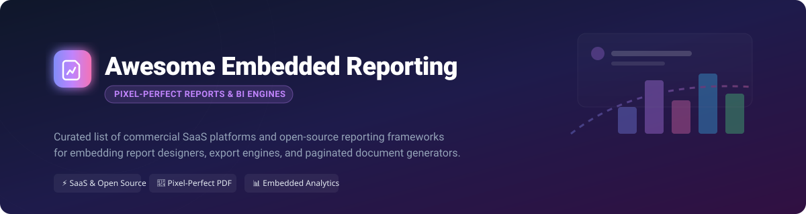

# Awesome Embedded Reporting Platform 📊

  

  
  
  
  
  

> **A curated collection of top SaaS products, embedded reporting engines, open-source report designers, document generation libraries, and developer-friendly embedded analytics tools.**

---

## 🚀 Overview & Market Analysis 📈

The global **embedded analytics and reporting software market size** is estimated at **~$7.5 Billion to $9.2 Billion (2025–2026)** and is projected to expand at a CAGR of over 14% through 2030. 

The embedded reporting sector is **moderately fragmented**: standard embedded BI dashboarding has grown increasingly competitive, whereas **pixel-perfect paginated reporting** (for invoices, compliance filings, and formal statements) remains dominated by dedicated commercial component vendors alongside strong, established open-source reporting engines.

---

## 📑 Table of Contents
- [🏢 SaaS & Commercial Platforms](#-saas--commercial-platforms)
- [🔓 Open-Source GitHub Projects](#-open-source-github-projects)
- [📈 Star History](#-star-history)
- [🤝 Support & Sponsorship](#-support--sponsorship)
- [👥 How to Contribute](#-how-to-contribute)
- [⚠️ Disclaimer](#%EF%B8%8F-disclaimer)

---

## 🏢 SaaS & Commercial Platforms 💻

Below is a curated comparison of leading commercial embedded reporting platforms, sorted by **Company Size / Financial Scale (Descending)**:

| Platform | Description | Estimated Starting Price | Free Tier / Trial Limits | Company Scale (Revenue / Valuation) |
| :--- | :--- | :--- | :--- | :--- |
| **[SAP Crystal Reports](https://www.sap.com/)** 💎 | Classic enterprise reporting tool for pixel-perfect operational & business reports. | **$495** / standalone perpetual license ($869+ for Crystal Server) | **30-day full free trial** (plus free read-only Crystal Reports Viewer) | **Public (SAP SE)**: ~$35B+ Revenue / ~$250B+ Market Cap |
| **[Logi Report (insightsoftware)](https://www.insightsoftware.com/)** 📊 | Enterprise embedded reporting & BI analytics engine tailored for host applications. | **Quote-based** (~$1,000+/mo estimated depending on scale) | **15-day limited evaluation trial** | **PE-Backed**: ~$600M Revenue / ~$4.0B Valuation |
| **[Telerik Reporting (Progress)](https://www.telerik.com/products/reporting.aspx)** 🛠️ | Developer-focused .NET reporting toolkit with rich web/desktop designers & APIs. | **$489** / developer / year | **30-day free trial** (fully functional, watermarked output) | **Public (Progress PRGS)**: ~$1.0B Revenue / ~$1.7B Market Cap |
| **[DevExpress Reporting](https://www.devexpress.com/)** ⚡ | High-performance .NET reporting components with end-user designer & export engines. | **$899.99** / developer / year | **30-day free trial** (unconditional 60-day money-back guarantee) | **Private Entity**: Estimated ~$100M–$150M Revenue |
| **[Windward / Fluent (Apryse)](https://www.windwardstudios.com/)** 📝 | Template-driven document and report generation platform using MS Word/Excel. | **$209** / month (Pay-per-Report plan) or $496/mo (Per-Server) | **30-day free trial** | **Acquired by Apryse**: Parent PE-Backed (~$100M+ Revenue) |
| **[Jaspersoft (HCLSoftware)](https://www.jaspersoft.com/)** ☕ | Commercial enterprise edition of JasperReports with server deployment & multi-tenancy. | **Quote-based** (tailored to CPU cores/servers) | **30-day free trial** (Open-source JasperReports Library remains free) | **HCLSoftware Division**: Historical ~$52.8M unit revenue |
| **[Stimulsoft Reports](https://www.stimulsoft.com/)** 🎨 | Cross-platform reporting tools & HTML5/JS designers for web, desktop, and mobile. | **$480** / year (Single developer license) | **60-day free trial** (watermarked report output) | **Private Entity**: Estimated ~$10M–$25M Revenue |
| **[Syncfusion Bold BI / Bold Reports](https://www.boldreports.com/)** 🚀 | Web-based report designer, RDL compatibility, multi-tenancy & embedded analytics. | **$495** / month per server | **30-day free trial** (Free Community License for startups <$1M rev) | **Private Entity**: Estimated ~$15M–$30M Revenue |
| **[Izenda (insightsoftware)](https://www.izenda.com/)** 📈 | Embedded BI and operational reporting platform for ISVs and enterprise software. | **$999** / month estimated | **No self-service free trial** (Sales demo on request) | **Acquired Product**: Standalone ~$1.7M Revenue |

---

## 🔓 Open-Source GitHub Projects 🌟

High-quality open-source reporting engines, document generators, and self-hosted report servers, sorted by **GitHub_Stars (Descending)**:

-  **[Carbone](https://github.com/carboneio/carbone)** ⚡  
  Fast template-based document & report generator for Node.js using OpenDocument/Office files (PDF, DOCX, XLSX, PPTX).

-  **[Seal Report](https://github.com/ariacom/seal-report)** 🦭  
  Complete open-source (.NET, MIT) reporting framework offering dynamic SQL sources, pivot tables, HTML5 charts, task scheduler, and web server for embedding.

-  **[JasperReports Library](https://github.com/Jaspersoft/jasperreports)** ☕  
  The world's most widely used open-source Java reporting engine—delivers pixel-perfect documents, rich data sources, and export formats (PDF, Excel, Word, HTML).

-  **[jsreport](https://github.com/jsreport/jsreport)** 📜  
  Open-source JavaScript reporting platform allowing report generation via HTML/CSS templates, PDF rendering, Excel export, and REST API embedding.

-  **[docx-templates](https://github.com/guigrpa/docx-templates)** 📄  
  Template-based Word (DOCX) document generation engine for Node.js and browser environments with inline JS code support.

-  **[Helical Insight](https://github.com/helicalinsight/helicalinsight)** 💡  
  Open-source BI framework featuring pixel-perfect paginated reporting, self-service report designer, multi-tenancy, and API embedding.

-  **[Eclipse BIRT](https://github.com/eclipse-birt/birt)** 🌐  
  Classic open-source Eclipse reporting & data visualization project providing report designers and runtime engines for Java applications.

-  **[Apache POI](https://github.com/apache/poi)** 📊  
  Master Java API library used extensively alongside open-source report engines to generate and manipulate MS Excel and Office documents.

---

## 📈 Star History 

---

## 🤝 Support & Sponsorship 💖

Thank you for visiting and using **Awesome-Embedded-Reporting-Platform**! 🌟  
If you find this list helpful for evaluating reporting tools or building your application stack, please consider:
- ⭐️ **Starring** this repository to help others discover it!
- 🔀 **Forking** and contributing new tools or updates.
- 📢 **Sharing** with fellow developers and software architects!

If you'd like to support the maintenance of awesome open-source lists, feel free to buy a coffee:

---

## 👥 How to Contribute 🤝

1. Fork the repo. 🍴
2. Add/edit entries in `README.md` following the standard table or list format. ✏️
3. Include relevant pricing, free trial limits, or repository Stars_Badges. 🏷️
4. Submit a Pull Request with a short explanation. 🚀

---

## ⚠️ Disclaimer 

- This is a **community-curated list** — provided for informational and educational purposes only.
- Reporting engines handle critical enterprise data. Ensure proper authentication, security controls, and compliance testing before deploying any engine in production environments.

---

Made with ❤️ for application developers, ISVs, and enterprise reporting architects.

